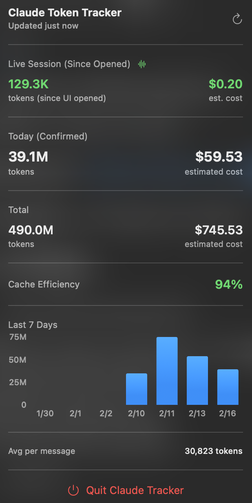

# Claude Token Tracker

<div align="center">

A lightweight, native macOS menubar application for tracking Claude API token usage and costs.

**100% AI-Generated Code** • Built with Claude Sonnet 4.5


*A demonstration of AI-native software development*

📖 **[Read our Philosophy on AI-Native Development →](PHILOSOPHY.md)**
🔧 **[Technical Documentation →](TECHNICAL.md)**

</div>

## ⚡ The Future of Development

This project is **entirely AI-generated** - not a single line of code was manually typed. It demonstrates:

- 🤖 **AI as Developer** - Claude Sonnet 4.5 wrote 100% of the Swift code
- 👨‍💻 **Human as Architect** - Petr provided requirements, reviewed, and tested
- 🔄 **Iterative Refinement** - Back-and-forth conversation to perfect the implementation
- ✅ **Production Quality** - Proper sandboxing, security, and Apple best practices
- 📚 **Full Documentation** - README, contributing guide, all AI-generated

**See [CODE_OF_CONDUCT.md](CODE_OF_CONDUCT.md) for our AI-native development philosophy.**

## Features

✨ **Live Session Tracking** - Real-time token counter updates as you chat (2 Hz polling)
📊 **Visual Analytics** - 7-day usage chart with daily breakdown
💰 **Cost Estimation** - Calculates costs based on Anthropic pricing
📈 **Dual Monitoring** - Historical stats from cache + live JSONL file monitoring
⚡ **Ultra Lightweight** - Uses only 8-15MB RAM with 0% CPU in background
🔋 **Battery Efficient** - Kernel-level file monitoring (FSEvents) + smart caching
🎨 **Native UI** - SwiftUI interface with dark mode support
🔒 **Sandboxed** - Follows Apple's security best practices

## Screenshots

<div align="center">



*Real-time token tracking with live session monitoring*

</div>

## Installation

### Option 1: Download DMG (Recommended)

1. Download [Claude-Tracker.dmg](https://github.com/yourusername/Claude-Tracker/releases/latest)
2. Open the DMG file
3. Drag **Claude-Tracker.app** to your Applications folder
4. Launch from Applications
5. On first launch, grant access to the `~/.claude` folder when prompted

> **Note**: The app may show a security warning on first launch (unsigned app). Right-click the app and select "Open" to bypass Gatekeeper.

### Option 2: Build from Source

1. Clone the repository:
   ```bash
   git clone https://github.com/yourusername/Claude-Tracker.git
   cd Claude-Tracker
   ```

2. Open in Xcode:
   ```bash
   open Claude-Tracker/Claude-Tracker.xcodeproj
   ```

3. Build and run (⌘+R)

4. On first launch, grant access to the `~/.claude` folder when prompted

## Usage

1. **Launch the app** - A Claude C icon appears in your menubar
2. **Grant file access** - On first launch, select the `.claude` folder in your home directory (press ⌘⇧. to show hidden files)
3. **Click the icon** - View your token usage statistics in real-time

The app runs silently in the menubar and automatically updates when you use Claude Code!

## How It Works

Claude Tracker uses a dual monitoring approach for comprehensive token tracking:

### 1. Historical Stats Monitoring
Monitors `~/.claude/stats-cache.json` for confirmed usage data:
- **FSEvents** - Kernel-level file monitoring for zero CPU overhead
- **Auto-refresh** - Updates every 3 seconds for recent stats
- Displays: Today's usage, total usage, 7-day chart, cache efficiency

### 2. Live Session Tracking
Monitors active conversation JSONL files in `~/.claude/projects/`:
- **Real-time updates** - Polls at 2 Hz (0.5s) when UI is open
- **Smart file detection** - Automatically finds the most recently modified conversation
- **Session tracking** - Shows tokens consumed since you opened the menubar
- **Efficient caching** - Caches active file path to avoid directory scanning

### Technical Implementation
- **Security-Scoped Bookmarks** - Proper sandboxed file access to `.claude` folder
- **SwiftUI** - Native, efficient UI rendering
- **DispatchQueue** - Background parsing on utility QoS
- **Adaptive polling** - 2 Hz active, 30s background to save battery

### Performance Targets

- **Memory**: 8-15 MB (idle)
- **CPU**: 0.0% (background)
- **Battery Impact**: None (Activity Monitor: "No impact")

## Privacy & Security

- ✅ **Sandboxed** - Runs in App Sandbox for security
- ✅ **Read-only access** - Only reads stats, never modifies anything
- ✅ **No network** - All data stays on your device
- ✅ **No telemetry** - We don't collect any usage data
- ✅ **Open source** - Fully auditable code

## Requirements

- macOS 13.0 (Ventura) or later
- Claude Code installed and configured
- Xcode 15+ (for building from source)

## Pricing Calculation

Token costs are estimated based on [Anthropic's pricing](https://www.anthropic.com/pricing):

- **Input tokens**: $3.00 per 1M tokens
- **Output tokens**: $15.00 per 1M tokens
- **Cache writes**: $3.75 per 1M tokens
- **Cache reads**: $0.30 per 1M tokens

*Note: Costs are estimates and may not reflect your actual billing. Check your Anthropic dashboard for accurate billing information.*

## Development

### Project Structure

```
Claude-Tracker/
├── ClaudeStats.swift          # Data models & JSON parsing
├── StatsMonitor.swift         # File monitoring & state management
├── LiveTokenMonitor.swift     # Real-time JSONL conversation tracking
├── FileAccessManager.swift    # Sandboxed file access
├── MenuBarView.swift          # SwiftUI UI components
├── Claude_TrackerApp.swift    # App lifecycle & menubar
└── Info.plist                 # App configuration
```

### Architecture

```
FileAccessManager (Singleton)
    ↓ Security-scoped bookmarks for ~/.claude folder
    ↓
StatsParser                      LiveTokenMonitor
    ↓ JSON parsing                   ↓ JSONL file monitoring
    ↓                                ↓ Active conversation detection
    ↓                                ↓ Real-time token counting
    ↓                                ↓
StatsMonitor (ObservableObject) ←──┘
    ↓ FSEvents monitoring
    ↓ Published state (2 data sources)
    ↓
MenuBarPopoverView (SwiftUI)
    ↓ SwiftUI Charts
    ↓ Live session display
    ↓ User interface
```

### Contributing

Contributions are welcome! **But remember: we prefer AI-generated code.**

See [CONTRIBUTING.md](CONTRIBUTING.md) for guidelines.

**The AI-Native Way:**
1. Describe what you want to add (in an issue or PR description)
2. Share your conversation with Claude/GPT that implements it
3. Submit the generated code with proper attribution
4. Include `Co-Authored-By: Claude Sonnet 4.5 <noreply@anthropic.com>` in commits

**Traditional contributions** (manually written code) are still accepted, but we'll ask "why didn't you just ask Claude?" 😉

Read our [AI-Native Code of Conduct](CODE_OF_CONDUCT.md) to understand our development philosophy.

## Roadmap

- [ ] App Store distribution
- [ ] Launch at login option
- [ ] Custom cost thresholds with notifications
- [ ] Export usage data to CSV/JSON
- [ ] Widget support (macOS 14+)
- [ ] Multiple Claude account support
- [ ] Customizable refresh intervals

## FAQ

**Q: Why do I need to grant file access?**
A: The app is sandboxed for security. Security-scoped bookmarks allow safe, persistent access to the `.claude` folder (for both stats-cache.json and conversation JSONL files).

**Q: What is "Live Session (Since Opened)"?**
A: This tracks tokens consumed in the active conversation since you opened the menubar popover. It updates in real-time (every 0.5s) by monitoring the JSONL conversation file.

**Q: Why are there two token counts?**
A: "Live Session" shows real-time usage from the current conversation. "Today (Confirmed)" shows verified stats from Claude Code's cache. Live updates immediately; confirmed updates after conversations complete.

**Q: Will this work with claude.ai?**
A: No, this only tracks usage from Claude Code (the CLI tool). claude.ai usage is tracked separately in your Anthropic account.

**Q: Does this affect Claude Code performance?**
A: No, the app only reads files that Claude Code writes. No interference with Claude Code operation. Efficient caching minimizes file system overhead.

**Q: Can I use this on Windows/Linux?**
A: Currently macOS only. A cross-platform version using Tauri could be developed if there's interest.

## License

This project is licensed under the MIT License - see the [LICENSE](LICENSE) file for details.

## Acknowledgments

- Built **entirely** with Claude Sonnet 4.5 (not a single line manually typed)
- Human architect: Petr Guan (prompting, testing, reviewing)
- Inspired by iStat Menus and other system monitoring tools
- Thanks to Anthropic for creating Claude and Claude Code
- A demonstration that AI can generate production-quality, App Store-ready code

## Meta

This README was also AI-generated. The irony is not lost on us.

## Support

- 🐛 [Report a bug](https://github.com/yourusername/Claude-Tracker/issues)
- 💡 [Request a feature](https://github.com/yourusername/Claude-Tracker/issues)
- ⭐ Star this repo if you find it useful!
- 🤖 Share your AI-generated contributions

---

Made with ❤️ (and AI) for the Claude Code community

*Humans provide vision. AI provides implementation. Together, we build the future.*
